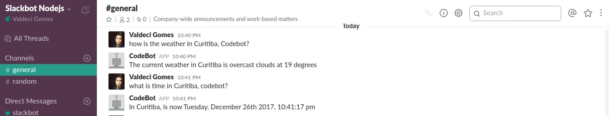
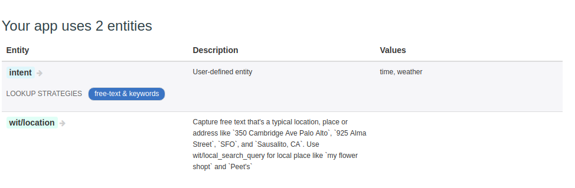

# Node.js Microservice-based Slack Bot

Slack Bot application developed in Node.js.



The project is seted up with a basic express application, a bot using [Slack](https://slack.com/) and uses the [Wit.ai](https://wit.ai/) service to works with natural language processing.

This way, to use this project we will need to create a Slack channel and create a Bot user app and you will also need to create a Wit.ai app to handle the bot questions intents.


### Creating the Slack Bot user

To use a bot on Slack for this project, I created a bot user. Creating a new bot user is currently not completely intuitive, as there is no dedicated option on the settings page of Slack, but to create for this project you can read the Slack official
[doc](https://api.slack.com/bot-users).

### Creating the Wit.ai app

To create the Wit.ai app, you will need to log in the [Wit.ai](https://wit.ai/) site with your Github account.

Then, we will need to create an app importing the data from the [codebot-witai-settings](https://github.com/coderade/codebot-witai-setting) project as a zip file. This wit.ai project contains all the needed intents to run this project.



### Project Intents

This project actually has two intents: the [Time](server/intents/timeIntent.js) and [Weather](server/intents/weatherIntent.js) intents. But, if you want you can create a new one following the [intent.example.js](server/intents/intent.example.js) file.

The are two services projects serving the intents for this project, so we need to execute these two project services to make the Bot works properly:

* [Time Microservice](https://github.com/coderade/nodejs-time-microservice) ->
service that returns the local time for a given location.
* [Weather Microservice](https://github.com/coderade/nodejs-weather-microservice) -> service that returns the weather for a given location.

The services projects are available on your specific Github project links.

These services know the endpoint address of this main application and announce itself
to the intent that they want to serve on the project.

This main application keep the track of the services available and route the requests using a Service registry.

## How to use

Download and install the Node.Js using the [NVM](https://github.com/creationix/nvm).

Install the [yarn](https://yarnpkg.com/en/) following the official
[documentation](https://yarnpkg.com/lang/en/docs/install/#linux-tab).

Clone the repository and install the node modules.

`yarn install`

After this, you can run the service.


## Running the bot app

To run this application, an API key for the
[Wit.ai](https://wit.ai) app and the [Slack bot API](https://api.slack.com/bot-users) will be necessary.

After you create your API key for each one of these services you will need to pass them as environment variables.

This project uses the [dotenv](https://github.com/motdotla/dotenv) module to load the environment variables, so on the 
root directory of the project use the following command to copy the env example file to the `.env` file that will be 
used to load the environment variables.

`cp .env-example .env`

Then, you can edit the `BOT_API_TOKEN` and `WIT_TOKEN` environment variables with your generated keys, 
like the following:

```docker
BOT_API_TOKEN=0000-0000-0000-0000-0000
WIT_TOKEN=0000-0000-0000-0000-0000
```

You can also pass the environment variables on your IDE. 
I use the [WebStorm](https://www.jetbrains.com/webstorm) IDE to debug my Node.js applications, which you can follow this
[tutorial](https://www.jetbrains.com/help/webstorm/run-debug-configuration-node-js.html) to set Node.js environment 
variables in this IDE.

Otherwise, if you don't want to use the `dot-env` module or a IDE you can pass the SLACK Bot and Wit.ai API keys 
directly on your command line.

To do this, on the root directory of the project run the following command
passing your `WIT_TOKEN` and `BOT_API_TOKEN` as env parameters:

`WIT_TOKEN=<WIT_TOKEN> BOT_API_TOKEN=<YOUR SLACK BOT API KEY> node bin/start.js`

If everything is ok, the console will show the following message:

```
verbose: Attempting to connect via the RTM API
verbose: Retrying url=https://slack.com/api/rtm.start
verbose: rtm.start successful, attempting to open websocket URL
Logged in as coderade-bot of team Slackbot Nodejs, but not connected to a channel yet
CODEBOT is listening in 3000 in development mode.
```
Now, you will see that your bot app will be online on your Slack channel and
available to answer your questions!
